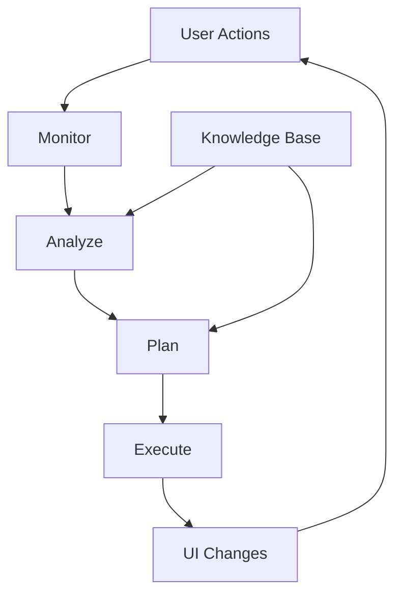

# MAPE-K Adaptation System Guide

## Overview

The MAPE-K (Monitor, Analyze, Plan, Execute, Knowledge) adaptation engine is a self-adaptive system that learns from user behavior and automatically adjusts the EHR interface to improve usability and efficiency.

## Architecture Flow



## The 5 Components

### 1. **MONITOR** - Data Collection

**Location:** `app/frontend/lib/monitorService.ts` and `app/backend/api/routes/monitor.py`

**What it does:**
- Collects user behavior data in real-time
- Logs navigation patterns (section changes)
- Tracks AI suggestion interactions (accept/ignore/not relevant)
- Monitors patient risk level changes
- Records model outputs and timestamps

**Frontend Implementation:**
```typescript
// Automatically logs when user navigates between sections
await monitorService.logNavigation({
  patientId: patientId,
  fromSection: previousSection,
  toSection: newSection,
});

// Logs when user interacts with AI suggestions
await monitorService.logSuggestionAction({
  suggestionId: suggestion.id,
  action: 'accept' | 'ignore' | 'not_relevant',
  patientId: patientId,
});

// Logs when patient risk level changes
await monitorService.logRiskChange({
  patientId: patientId,
  newRiskLevel: 'high_concern',
  previousRiskLevel: 'routine',
});
```

**Backend Storage:**
- All monitoring data stored in `user_actions` table
- Includes timestamps, user IDs, patient IDs, action types
- Used for analysis and research

---

### 2. **ANALYZE** - Pattern Recognition

**Location:** `app/backend/services/mape_k_analyze.py`

**What it does:**
- Processes collected monitoring data
- Identifies usage patterns and trends
- Calculates metrics (acceptance rates, navigation frequency, risk escalations)
- Generates insights and recommendations

**Analysis Types:**

#### Navigation Analysis
- Counts section visits
- Identifies most frequently visited sections
- Tracks common navigation paths
- Example: "User visits 'vitals' section 15 times, 'labs' 8 times"

#### Suggestion Analysis
- Calculates acceptance rate (accepts / total suggestions)
- Calculates ignore rate (ignores / total suggestions)
- Identifies suggestion relevance
- Example: "Acceptance rate: 75% (high), Ignore rate: 15% (low)"

#### Risk Analysis
- Tracks risk level escalations
- Monitors risk change frequency
- Example: "Patient risk escalated 2 times in the last 30 days"

**Output:**
```json
{
  "navigation_patterns": {
    "total_navigations": 45,
    "section_visits": {
      "vitals": 15,
      "labs": 8,
      "imaging": 5
    },
    "most_visited": "vitals"
  },
  "suggestion_actions": {
    "acceptance_rate": 0.75,
    "ignore_rate": 0.15
  },
  "insights": [
    "User frequently navigates to 'vitals' section",
    "High suggestion acceptance rate (75%) - suggestions are valuable"
  ],
  "recommendations": [
    "Move 'vitals' section higher in the layout",
    "Maintain or increase suggestion frequency"
  ]
}
```

---

### 3. **PLAN** - Adaptation Strategy Generation

**Location:** `app/backend/services/mape_k_plan.py`

**What it does:**
- Takes analysis results and generates concrete adaptation plans
- Creates JSON layout plans with section ordering
- Determines suggestion density (low/medium/high)
- Applies rules from the Knowledge Base

**Knowledge Base Rules:**
```python
KNOWLEDGE_BASE = {
    "navigation_threshold": 5,  # Minimum visits to prioritize a section
    "ignore_rate_threshold": 0.5,  # If >50% ignored, reduce density
    "acceptance_rate_threshold": 0.7,  # If >70% accepted, maintain/increase
    "risk_escalation_threshold": 1,  # If >1 escalation, prioritize monitoring
}
```

**Planning Rules:**

1. **Navigation-Based Reordering:**
   - If a section is visited ≥5 times, move it up in the layout
   - Most visited section goes to position 2 (after summary)

2. **Suggestion Density Adjustment:**
   - If ignore rate > 50% → Set density to "low"
   - If acceptance rate > 70% → Set density to "high"
   - Otherwise → Set density to "medium"

3. **Risk-Based Prioritization:**
   - If risk escalations ≥ 1 → Prioritize "vitals" and "imaging" sections
   - Move monitoring sections to the top

**Output - Adaptation Plan:**
```json
{
  "order": [
    "summary",
    "vitals",        // ← Moved up based on usage
    "demographics",
    "labs",          // ← Moved up based on usage
    "diagnoses",
    "medications",
    "allergies",
    "clinical-notes",
    "problems",
    "history",
    "imaging",
    "suggestions",
    "safety"
  ],
  "suggestion_density": "high",  // ← Based on acceptance rate
  "flags": {
    "prioritized_section": "vitals",
    "high_acceptance_rate": true
  },
  "explanation": "Sections reordered based on usage patterns: summary, vitals, labs prioritized. Suggestion frequency maintained/increased due to high acceptance rate."
}
```

**Storage:**
- Plans stored in `adaptations` table
- Linked to user_id and optionally patient_id
- Includes timestamp for versioning

---

### 4. **EXECUTE** - UI Application

**Location:** `app/frontend/app/patients/[id]/page.tsx` and `app/frontend/lib/adaptationService.ts`

**What it does:**
- Fetches the latest adaptation plan from the backend
- Applies the plan to the frontend UI
- Reorders sections in the navigation and content
- Adjusts suggestion display frequency
- Shows adaptation indicator to the user

**Frontend Flow:**

1. **On Page Load:**
```typescript
useEffect(() => {
  if (patientId && isAuthenticated) {
    fetchAndApplyAdaptation();
  }
}, [patientId, isAuthenticated]);
```

2. **Fetch and Apply:**
```typescript
const fetchAndApplyAdaptation = async () => {
  const adaptation = await adaptationService.getLatestAdaptation(patientId);
  
  if (adaptation && adaptation.plan_json) {
    const plan = adaptation.plan_json;
    
    // Apply section ordering
    if (plan.order) {
      setSectionOrder(plan.order);  // Updates Zustand store
    }
    
    // Apply suggestion density
    if (plan.suggestion_density) {
      setSuggestionDensity(plan.suggestion_density);  // Controls AI suggestion frequency
    }
    
    // Mark adaptation as active
    setAdaptationActive(true);
    setAdaptationExplanation(plan.explanation);
  }
};
```

3. **UI Updates:**
   - `SectionNavigation` component uses `sectionOrder` from store
   - Sections are rendered in the new order
   - `SuggestionsPanel` uses `suggestionDensity` to filter suggestions
   - `AdaptationIndicator` shows when adaptations are active

**Visual Feedback:**
- Blue banner appears at top of patient detail page
- Shows explanation: "Sections reordered based on usage patterns..."
- "Reset Layout" button to return to default
- "Experimental" badge for transparency

---

### 5. **KNOWLEDGE** - Rules and Thresholds

**Location:** `app/backend/services/mape_k_plan.py` (KNOWLEDGE_BASE)

**What it contains:**
- Adaptation rules and thresholds
- Default section ordering
- Decision logic for when to adapt
- Configuration parameters

**Current Knowledge Base:**
```python
DEFAULT_ORDER = [
    "summary", "demographics", "diagnoses", "medications",
    "allergies", "vitals", "labs", "imaging", "suggestions", "safety"
]

KNOWLEDGE_BASE = {
    "navigation_threshold": 5,
    "ignore_rate_threshold": 0.5,
    "acceptance_rate_threshold": 0.7,
    "risk_escalation_threshold": 1,
}
```

**Extensibility:**
- Rules can be updated via admin panel
- Thresholds can be adjusted based on research findings
- New adaptation strategies can be added

---

## Complete Workflow Example

### Scenario: Clinician frequently checks vitals

1. **Monitor:**
   - User navigates: Summary → Vitals (logged)
   - User navigates: Demographics → Vitals (logged)
   - User navigates: Labs → Vitals (logged)
   - ... (15 total vitals visits in 30 days)

2. **Analyze:**
   - Analysis detects: "vitals" is most visited (15 times)
   - Recommendation: "Move 'vitals' section higher in the layout"

3. **Plan:**
   - Plan generated with "vitals" moved to position 2
   - New order: [summary, vitals, demographics, ...]
   - Explanation: "Sections reordered based on usage patterns"

4. **Execute:**
   - Frontend fetches plan on next page load
   - Section navigation reordered
   - Vitals section now appears second
   - Blue banner shows: "UI Adapted for You"

5. **Result:**
   - User sees vitals section immediately after summary
   - Faster access to frequently used information
   - User can reset if they prefer default layout

---

## API Endpoints

### Backend Endpoints

**POST `/api/v1/monitor/log-navigation`**
- Logs section navigation
- Body: `{ patient_id, from_section, to_section }`

**POST `/api/v1/monitor/log-suggestion-action`**
- Logs AI suggestion interaction
- Body: `{ suggestion_id, action, patient_id }`

**POST `/api/v1/mape-k/analyze`**
- Triggers analysis of monitoring data
- Returns: Analysis results with insights

**POST `/api/v1/mape-k/plan`**
- Generates adaptation plan based on analysis
- Returns: Adaptation plan JSON

**GET `/api/v1/mape-k/adaptation/latest?patient_id=...`**
- Gets the most recent adaptation plan
- Returns: Adaptation plan or 404 if none exists

---

## User Experience

### When Adaptations Are Active

1. **Visual Indicator:**
   - Blue banner at top of patient detail page
   - Shows explanation of what changed
   - "Experimental" badge for transparency

2. **Section Reordering:**
   - Navigation tabs reordered
   - Content sections reordered
   - Most-used sections appear first

3. **Suggestion Density:**
   - **Low:** Fewer suggestions shown (if many ignored)
   - **Medium:** Standard suggestion frequency
   - **High:** More suggestions shown (if many accepted)

4. **User Control:**
   - "Reset Layout" button to return to default
   - User can always override adaptations
   - Adaptations are per-user, not global

---

## Research & Transparency

### Data Collection
- All monitoring data stored for research
- No PHI in monitoring logs
- User actions anonymized for analysis

### Transparency Features
- "Experimental" badges on all adaptive features
- Explanation of what changed and why
- User can view adaptation history (researcher/admin)
- All adaptations logged in audit trail

### Research Use Cases
- Study how UI adaptations affect workflow efficiency
- Analyze which sections are most important to clinicians
- Measure suggestion acceptance rates
- Track risk escalation patterns

---

## Configuration

### Admin Panel
- View all adaptations
- Configure adaptation thresholds
- Enable/disable adaptation features
- View adaptation statistics

### Knowledge Base Updates
- Thresholds can be adjusted
- New rules can be added
- Default ordering can be changed
- All changes logged for research

---

## Technical Details

### State Management
- Uses Zustand store (`patientDetailStore`)
- Stores: `sectionOrder`, `suggestionDensity`, `adaptationActive`
- Persists during session, resets on logout

### Database Schema
- `user_actions` table: Stores all monitoring data
- `adaptations` table: Stores generated plans
- Both tables include timestamps for temporal analysis

### Performance
- Analysis runs on-demand (not real-time)
- Plans cached in database
- Frontend fetches plan once per page load
- No performance impact on user interactions

---

## Future Enhancements

Potential improvements:
- Real-time adaptation (not just on page load)
- Machine learning for more sophisticated patterns
- A/B testing framework for adaptation strategies
- Multi-user collaboration adaptations
- Context-aware adaptations (time of day, patient type)

---

## Summary

The MAPE-K adaptation system creates a **self-improving EHR interface** that:

1. **Monitors** user behavior automatically
2. **Analyzes** patterns to understand preferences
3. **Plans** UI changes based on rules
4. **Executes** adaptations in the frontend
5. **Learns** from the Knowledge Base

The system is **transparent** (users see what changed), **controllable** (users can reset), and **research-focused** (all data logged for analysis).

